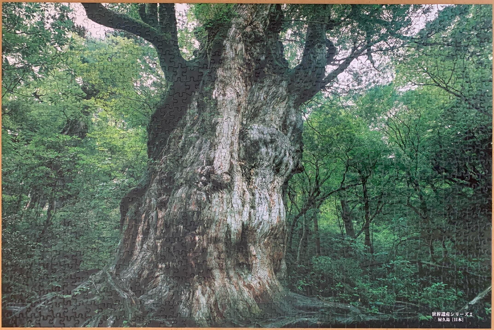
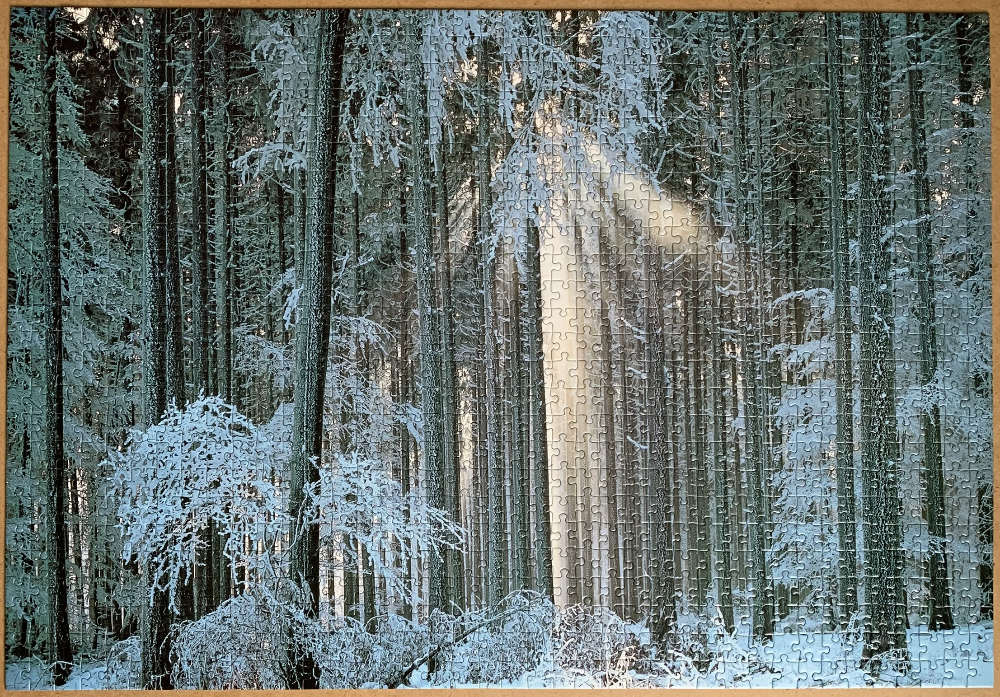
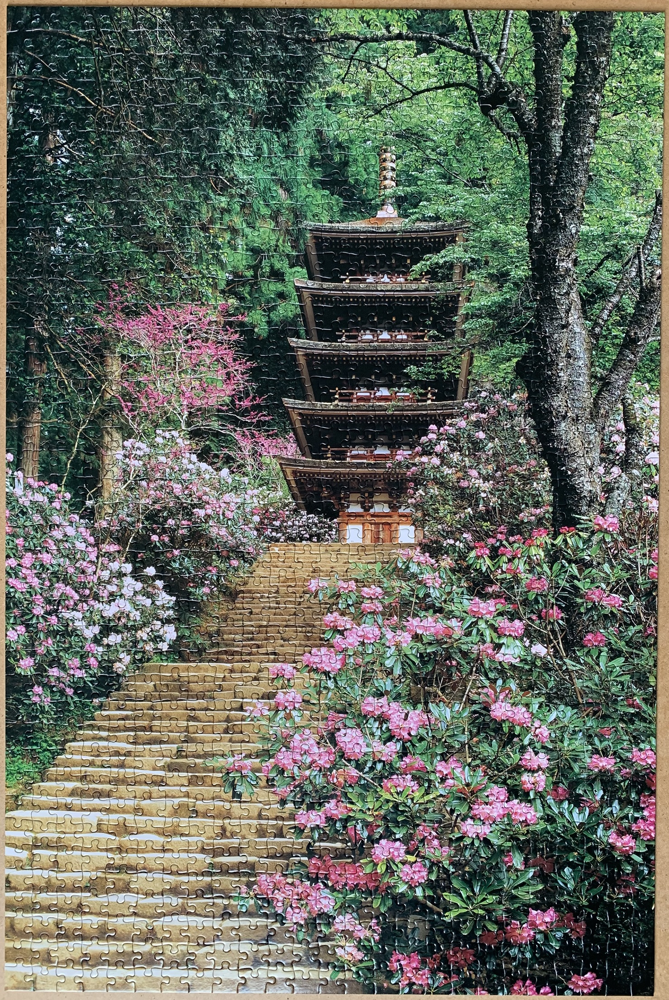
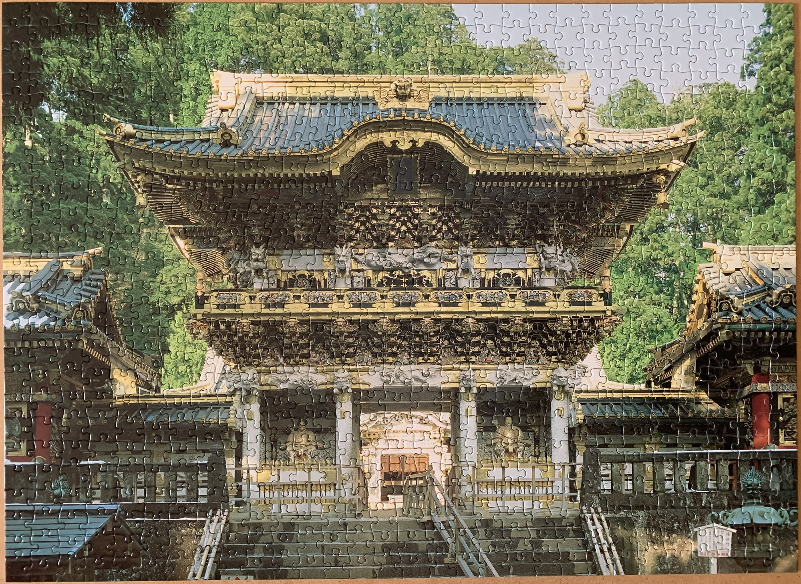

<a href="https://luffm.github.io/Jigsaw-Puzzles/">Jigsaw Puzzles</a>

## Yakushima JAPAN, The World Heritage
2022-06-02 

 1000 pieces

## Morning Tide
2022-01-23 

 1000 pieces

## Blooming Rhododendrons, Murouji Temple, Nara
2021-08-28 

 1000 pieces

## Yomeimon, Toshogu, Nikkou
2021-04-02 

 750 pieces

<a href="https://luffm.github.io/Jigsaw-Puzzles/">Jigsaw Puzzles</a>

